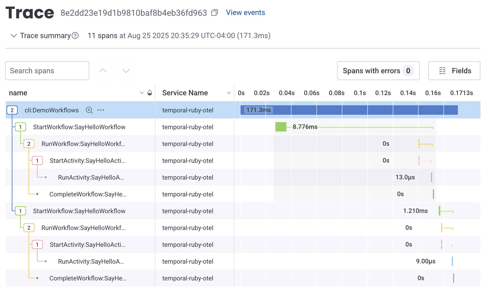

# Temporal Ruby + OpenTelemetry

This project demonstrates how to integrate [Temporal Ruby][1] with [OpenTelemetry][2] for observability of your workflow executions. It includes:

- 📊 **Basic OpenTelemetry Integration**: Currently instrumented for traces only
- ⚡ **Temporal Workflow**: A simple workflow adapted from the official Ruby quickstart
- 🚀 **Two trace backend options**:
  - Log to stdout with the `console` exporter
  - Send to [Honeycomb][3] with the OTLP exporter

> In addition to the official Ruby quickstart this project is based on prior work from the community [temporal-otel][9] project and WIP official [opentelemetry sample][10].


## Usage

### Prerequisites

- [mise][4]
- [Temporal CLI][5]


### Quick Start

1. **Install Ruby and dependencies:**

    ```bash
    # Install Ruby with mise
    mise install

    # Install all project dependencies
    bundle
    ```

1. **Start the Temporal server:**

    ```bash
    temporal server start-dev
    ```

1. **Run the worker and demo workflow** (in another new terminal):

    ```bash
    mise run worker ::: demo
    ```

This will run a Temporal worker and invoke a demo script to generate some data to look at. Visit the [Temporal UI](http://localhost:8233/) to see the workflow executions. Exit the worker with Ctrl+c.


### Explore Traces

To view telemetry generated by the demo workflow use one of the available trace backends:

#### 📝 **Log to stdout**

1. Run the worker and demo workflow and send spans to stdout using the `console` exporter:

    ```bash
    mise run console:*
    ```


#### 🔍 **Send to Honeycomb**

To send telemtry data to Honeycomb you'll need to provide an Ingest API Key via the `HONEYCOMB_API_KEY` environment variable. For details on how to create this key see [the honeycomb docs][6].

1. In Honeycomb, create an [Ingest API Key][7] with the following permissions:
   * Can create services/datasets

    > If you don't have a Honeycomb account, you can [sign up for a free Honeycomb account][8].

1. Add the key to a `.env` file at the root of this project:

    ```bash
    # Replace with your actual API key
    HONEYCOMB_API_KEY="hcaik_************"
    ```

1. Run the worker and demo workflow and send telemetry data to Honeycomb using the `OTLP` exporter:

    ```bash
    mise run honeycomb:*
    ```

1. Use Honeycomb to explore your trace data:

   


[1]: https://github.com/temporalio/sdk-ruby
[2]: https://opentelemetry.io/docs/
[3]: https://www.honeycomb.io/
[4]: https://mise.jdx.dev/
[5]: https://docs.temporal.io/cli
[6]: https://docs.honeycomb.io/send-data/ruby/opentelemetry-sdk/#get-your-honeycomb-api-key.
[7]: https://docs.honeycomb.io/configure/environments/manage-api-keys/#create-api-key
[8]: https://ui.honeycomb.io/signup
[9]: https://github.com/temporal-community/temporal-otel/
[10]: https://github.com/temporalio/samples-ruby/compare/main...cretz:temporal-samples-ruby:opentelemetry
